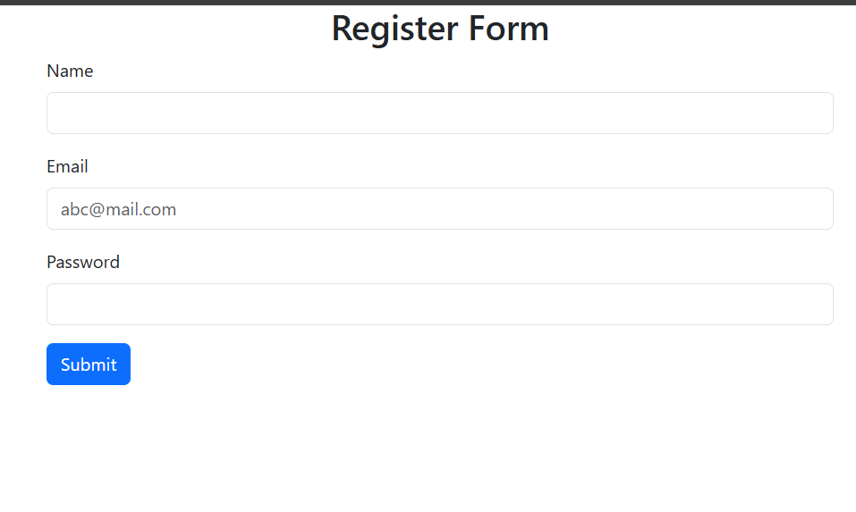
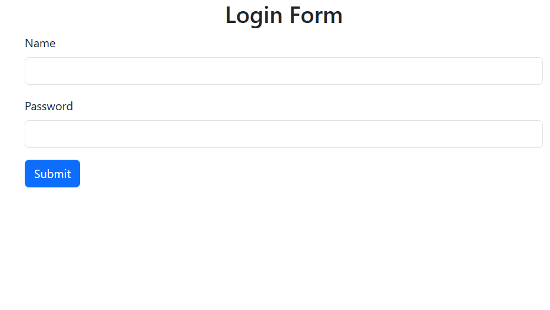

# Blog Project

A simple blog application built with **PHP, MySQL, HTML, CSS, JavaScript**.  
Users can register, log in, create blog posts, edit, and delete them.

---

## Tech Stack
- **Frontend:** HTML, CSS, JavaScript, Bootstrap
- **Backend:** PHP
- **Database:** MySQL
- **Tools:** Git, VS Code / Eclipse

---

## Features
- User authentication (Login/Register)
- Create, edit, delete blogs
- Image upload for posts
- Responsive design using Bootstrap

## Images

